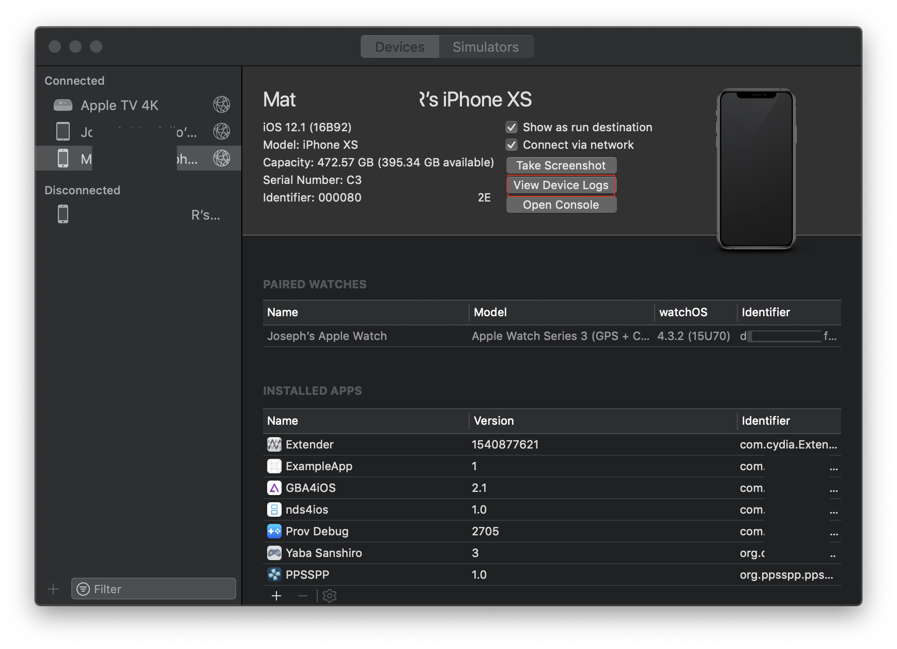

# Troubleshooting


**Provenance-Emu is a small team of volunteers.** First check [FAQs](https://github.com/Provenance-Emu/Provenance/wiki/Frequently-Asked-Questions) to see if your problem has already been explained.


 If you're having issues with the app, the best help you'll get is your own debugging.  
 Don't be a special ❄, Provenance has an assortment of ways to help troubleshoot:

* [Frequently Asked Questions](../faqs.md)
* 💢Troubleshooting and ⚠️Known Issues sub-sections on the wiki pages.
* Try debugging it yourself, see below…

## Viewing Log Data

### iPhone

#### **Crash logs**

1. Go to `Settings app -> Privacy -> Analytics -> Analytics Data`.
2. Search for Provenance log files and tap. 

> _You can use the share button to send the log data to our Discord \#help channel if you have the Discord iOS app installed._

### macOS

#### **Live app logging with NSLogger OS X app**

#### **Preferred Method**

Provenance uses [CocoaLumberjack](https://github.com/CocoaLumberjack/CocoaLumberjack) to collect and send log data to various locations. One of which is the Open Source log viewer application, [NSLogger](https://github.com/fpillet/NSLogger/).

NSLogger runs on both OS X and iOS devices and can be used to see log data from Provence in real time provided both the viewer and device running Provenance are reachable on the same network via Bonjour.

1. Download the latest releases of NSLogger.app [here](https://github.com/fpillet/NSLogger/releases)
2. Open the downloaded app on desktop
3. Make sure iPhone / Apple TV are on the same network as your desktop
4. Open Provenance app on your device
5. The NSLogger window will automatically appear.

_Tips_

* You can filter with the search bar on the upper right
* You can filter by specific severity code classes on the bottom right button `All levels | All tags`
  * Level 0 is Error, &lt;= 1 Error & Warning, &lt;= 2 Errors, Warnings and Info... up to 3 Debug, 4 Verbose.
  * Command + 0 through 4 to quickly change the severity filter
* You can view the exactly File + Line number the log lines are genered from by making the the _f_ button on the bottom toolbar is highlight as selected.

#### **Crash Reports via XCode**

1. Open XCode
2. Choose `Window -> Devices & Simulators`
3. Select your iOS or tvOS device \(plug in if not available over WiFi\)
4. Click `View Device Logs` to view logs \(may take a minute to download logs\)

#### **Live app logging via XCode**

1. Build and run the app via XCode
2. If the console \(bottom shelf of XCode\) isn't displayed, clock `View -> Debug Area -> Show Debug Area`
3. If the right panel of the console isn't visable click the icon on the far lower right of the bottom debug shelf.

You should see Provenance debugging statements as you run the app.

> _App must be started from within XCode for text to appear._

